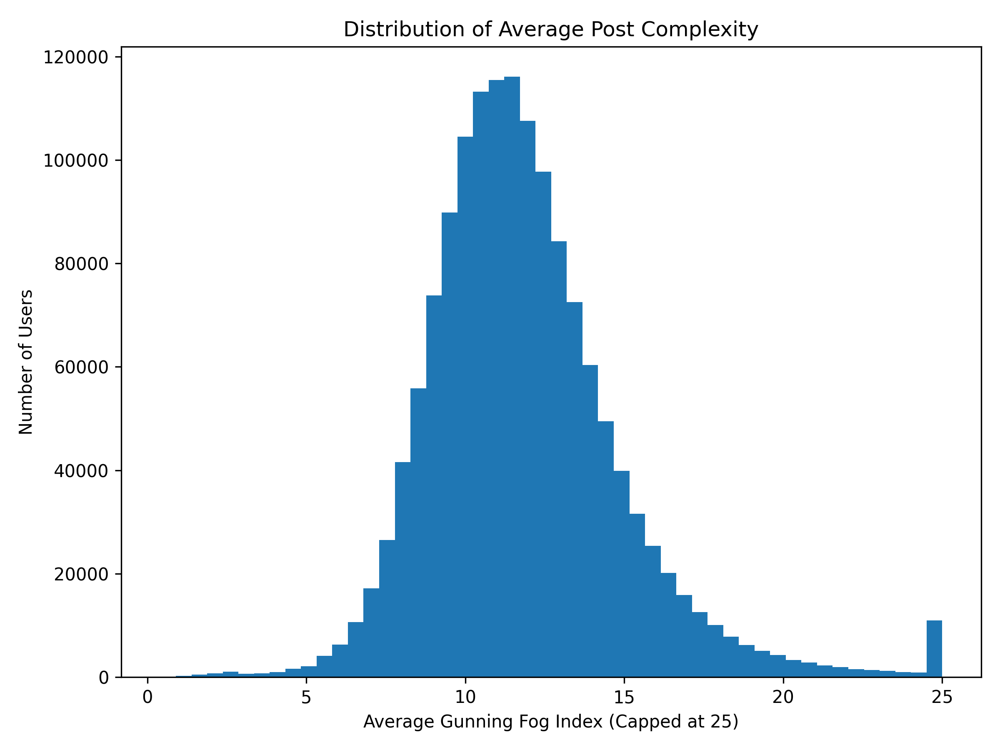
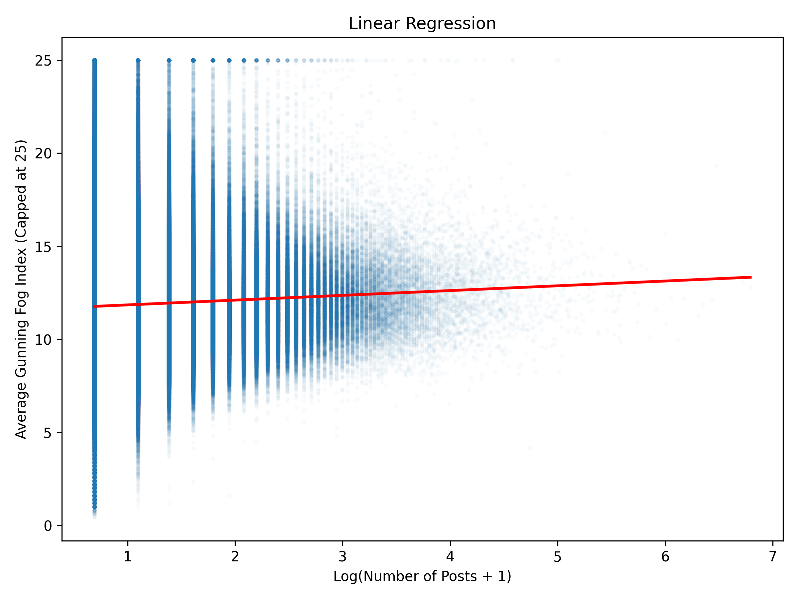

# Bookworm and/or Redditworm?: a Deep Dive into Redditors' Eloquency

_Eloquent Foggers: Sebastian Weber, Cedric Krug, Kalypso Dimou_

## Introduction

The social media platform of Reddit sterted as the place where people go to ask questions, find community and exchange advise and it has evolved into a meta-community. Users of such a community form distinct and niche subgroups (subreddits) which cross-interact and together comprise the recognisable-from-outsiders Reddit entity (Moore & Chuang, 2017). Socializing has been shown to be the number one reason behind Reddit posting, which can be attributed to anticipatory socialization defined like this:

    "Anticipatory socialization means that users obtain social gratifications from sharing original or curated content with other users. Aggregators, like Reddit, are virtual communities where sharing content facilitates social connections. [...] Users also help to enforce community standards through commenting (calling out trolls or those who are reposting content from another user and claiming it as original); thereby, strengthening the community of individual Subreddits and Reddit as a meta-community. Self-policing when it comes to agreed-upon behaviors is a crucial part of building and maintaining communities, both in person and online." (Moore & Chuang, 2017)

Like-minded individuals tend to form homogenous groups that reflect societal fragmentation. Boyd and Ellison (2008) suggest that it is common for social media users "to segregate themselves according to nationality, age, educational level, or other factors [...] even if that was not the intention of the designers". Our project looks into these subgroupings of redditors and seeks to find out the role that educational level plays in Reddit posting through the lens of Natural Language Processing. The literature indicates that as income and levels of education increases, social media increases as well (Mucan & Özgüven, 2022; Hruška & Maresova, 2020). It would be near impossible to guess one's education level employing solely NLP techniques, so the term 'eloquency' will be prefered from now on. This study will focus on the following questions:

1. How eloquent is the average redditor?
2. Which subreddits communicate on middle-school level and which on PhD-level?
3. Do popular subreddits use higher-level language?
4. Are users with more posts also more eloquent?

## Dataset

The dataset used is Webis-TLDR-17 corpus which was yielded by a large Reddit crawl. The corpus consists of 3,848,330 preprocessed posts (submissions and comments from multiple subreddits in the time period 2006-2016). Each post is comprised of strings for 'author', 'body', 'normalizedBody', 'content', 'summary', 'subreddit' and 'subreddit_id' with the average word count being 270 words for 'content' and 28 words for 'summary'.

For the purposes of the current research, we mainly used the features of 'author', 'subreddit' and 'content' and got rid of summaries completely. To reduce the size of the data, we filtered out posts with less than 100 words(_right?_), subreddits with less 50 posts and users exceeding 1000 contributions as it is highly likely that they were automated accounts. Resolving the latter issue is easier said than done, leaving room for doubt regarding all Reddit research results.

Our compiled dataset contained information on 1,462,079 Reddit users, including the total number of posts made by each user and the user's average Gunning Fog Index. To reduce the influence of extreme observations, the average Gunning Fog Index had previously been arbitrarily capped at a maximum value of 25.

## Methods

### Setup

Outline the tools, software, and hardware environment, along with configurations used for conducting your experiments. Be sure to document the Python version and other dependencies clearly. Provide step-by-step instructions on how to recreate your environment, ensuring anyone can replicate your setup with ease:

```bash
conda create --name myenv python=<version>
conda activate myenv
```

Include a `requirements.txt` file in your project repository. This file should list all the Python libraries and their versions needed to run the project. Provide instructions on how to install these dependencies using pip, for example:

```bash
pip install -r requirements.txt
```

### Experiments

To calculate the education level of the Reddit users, the Gunning fog index was employed, which is calculated by the formula:


First we needed to find the average number of sentences, words and complex words in each post and so, nine parameters were extracted in a csv file. The original features 'id', 'author', 'subreddit_id', 'subreddit' were maintained alongside the new data of 'word_count', 'syllable_count', 'complex_word_count' and 'complexity_index'. The 'complexity' term may be a bit misleading, in light of its range being 6 to 17. The higher the number the more years of formal education are needed to understand the text. The fog index is commonly used to confirm that an intended audience can easily read a text. Texts targeted to a wide audience generally need a fog index less than 12, or less than 8 for a near-universal understanding (DuBay, 2004). Gunning himself wrote (1969), twenty years after coming up with the formula, that the index is a "simple warning system" for writers, journalists and editors to keep their work in check, and never made a claim for it to be a decisive indicator for one's education level.

For the cleaning of the data, non Latin alphabet characters were ignored, as well numeric values, using the regular expression (r'\w+').
...

## Results and Discussion

### General Overview

### User analysis

Before performing the statistical analysis, records containing missing values in either the post count or average Gunning Fog Index were removed. Because the distribution of post counts was highly positively skewed, a logarithmic transformation using log(post count + 1) was applied. This transformation reduces the influence of users with exceptionally high posting activity and improves the suitability of the data for linear regression.



An ordinary least squares (OLS) linear regression model was fitted to examine whether posting activity could predict writing complexity.



The fitted regression model was statistically significant, p < .001, indicating that the predictor variable contributed significantly to explaining variation in writing complexity. The regression coefficient for the log-transformed post count was positive (β = 0.2565, SE = 0.005, t = 53.13, p < .001), suggesting that users with a higher number of posts tended to have slightly higher average Gunning Fog Index scores. Despite the highly significant p-value, the model explained only a very small proportion of the variance in writing complexity (R² = 0.002, adjusted R² = 0.002). This indicates that posting frequency alone accounts for approximately 0.2% of the observed variation in Gunning Fog scores. Given the very large sample size of more than 1.46 million users, the statistical significance of the regression should be interpreted alongside the effect size.

Several limitations should be considered when interpreting these findings. Firstly, the study is based on observational data and therefore cannot establish a causal relationship between posting frequency and writing complexity. Although a positive association was observed, it cannot be concluded that posting more causes users to write more complexly. Users participate in a wide range of subreddits covering very different topics and communication styles. For example, technical or academic communities may naturally contain more complex language than entertainment or meme-focused communities. Individual differences in education, native language, age, and writing ability may also influence Gunning Fog scores independently of posting activity. The regression model included only a single predictor variable. Incorporating additional explanatory variables in future research could provide a more comprehensive understanding of the factors associated with writing complexity on Reddit.

### Subreddit Analysis

Top 10 Subreddits (with more than 1000 posts) by average complexity (including only posts with a reasonable complexity <=25)

TODO

These results showcase one of the problems of the gunning fog index (and the underlying data) as the most complex subreddit in this example is r/argentina, which is a spanish foreign language subreddit. The gunning fog index however only applies to english. Because of this we are going to ignore r/argentina in further analysis.  
Other than that the results intuitively make sense. Historians for example are university educated, in a subject with a high focus on language. The complexity of this subreddit is likely further increased as they would use a lot of names of historical figures and places, which are likely to have at least 3 syllables and would therefore be counted as complex words.  
Similar reasoning applies to subreddits like philosophy and askscience.

Most of the other top 10 subreddits are political subreddits, where posters might purposefully use more eloquent language to appear more educated (and therefore correct) and since a lot of the political subreddits are more niche they might also discuss political theory, which implies a higher level of education.

Bottom 10 Subreddits (with more than 1000 posts) by average complexity (including only posts with a reasonable complexity <=25)

TODO

## Conclusion

The findings suggest that Reddit users who post more frequently tend to exhibit slightly higher average writing complexity, as measured by the capped Gunning Fog Index. This observation is consistent with the hypothesis that more active users may develop greater familiarity with written communication or participate in communities that encourage more detailed and complex discussions.However, the observed relationship is extremely small in practical terms. Although the regression model was statistically significant, it explained only 0.2% of the variance in writing complexity. This indicates that posting frequency alone is a poor predictor of the readability or complexity of users' writing.

It is important to remember that the Gunning Fog Index measures textual readability rather than education directly.

## Contributions

| Team Member     | Contributions                                            |
| --------------- | -------------------------------------------------------- |
| Cedric Krug     | Data cleaning , Graph plotting , Slideshow making        |
| Sebastian Weber | Data transforming , Subreddit slicing , Slideshow making |
| Kalypso Dimou   | Documentation , Statistical analysis , Slideshow making  |

## References

Burcu Mucan and Nihan Özgüven. 2013. The Relationship Between Personality Traits and Social Media Use. Social Behavior and Personality. _41(3)_, pages 517-528. http://dx.doi.org/10.2224/sbp.2013.41.3.517.

Carrie Moore and Lisa Chuang. 2017. Redditors Revealed: Motivational Factors of the Reddit Community. 10.24251/HICSS.2017.279.

Danah Boyd, and Nicole Ellison. 2008. Social network sites: Definition, history, and scholarship. Journal of Computer-Mediated Communication. _13_, pages 210-230. http://doi.org/gzn

Jan Hruška and Petra Maresova. 2020. Use of Social Media Platforms among Adults in the United States—Behavior on Social Media. Societies. _10_. 10.3390/soc10010027.

Martin Potthast, Michael V{"o}lske, Benno Stein and Shahbaz Syed. 2017. {TL};{DR}: Mining {R}eddit to Learn Automatic Summarization . In _Proceedings of the Workshop on New Frontiers in Summarization_, Association for Computational Linguistics, Copenhagen, Denmark, September 2017. pages 59-63. https://www.aclweb.org/anthology/W17-4508

Robert Gunning. (1969). The Fog Index After Twenty Years. Journal of Business Communication, _6(2)_, pages 3-13. https://doi.org/10.1177/002194366900600202

William H. DuBay. 2004. Judges Scold Lawyers for Bad Writing. Plain Language at Work Newsletter _(8)_. Impact Information. Archived from the original on 24 December 2013.

The Gunning's Fog Index (or FOG) Readability Formula. Readability Formulas.
